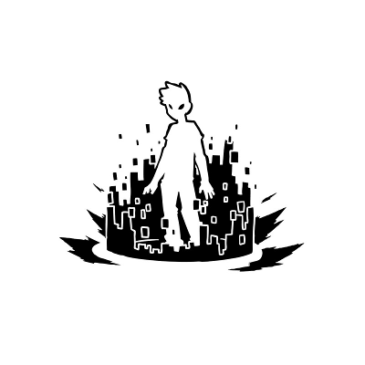

# • Corewar
The Corewar is a game where champions written in redcode (an assembly-like language) are fighting each other in a Virtual Machine (the Arena).

This project consists in two binaries :

+ asm
+ corewar

The asm compile redcode champions into binaries.
The corewar takes binaries created by the asm and make them fight.

## • Usage

To build the project :
```
make
```

To create binaries :
```
./asm/asm ./champ_src/<champion_name>.s
```

To start fighting :
```
./corewar/corewar <champ_one>.cor ... <champ_four>.cor
```
Can take 2 to 4 champions.

## • DevTeam

**Alif** Matthias (@alifdev) worked on the corewar.


**Rotaru** Iulian worked on the asm.
